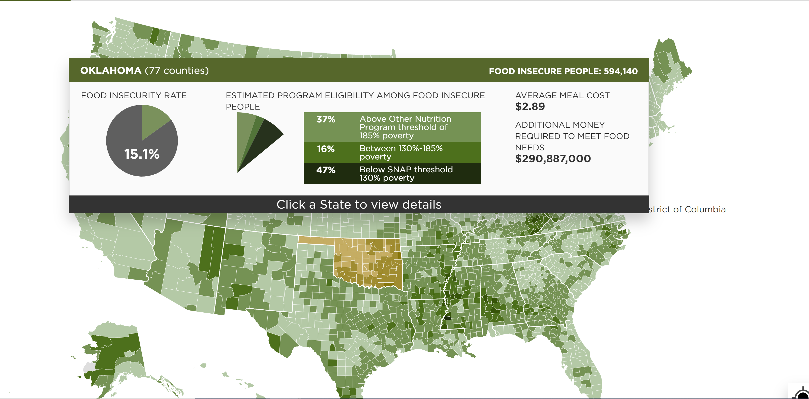
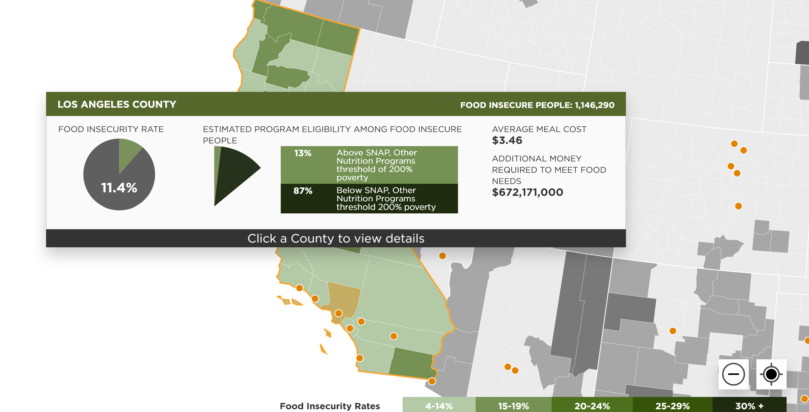
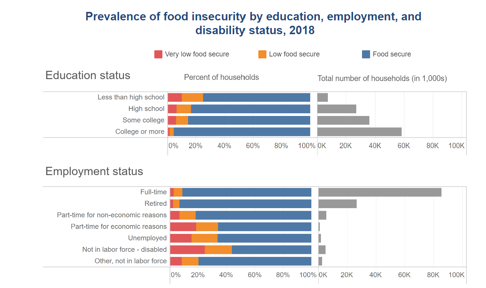
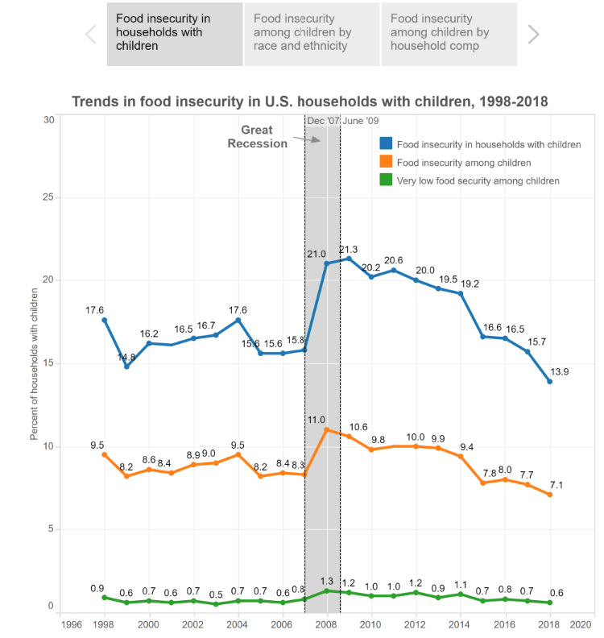
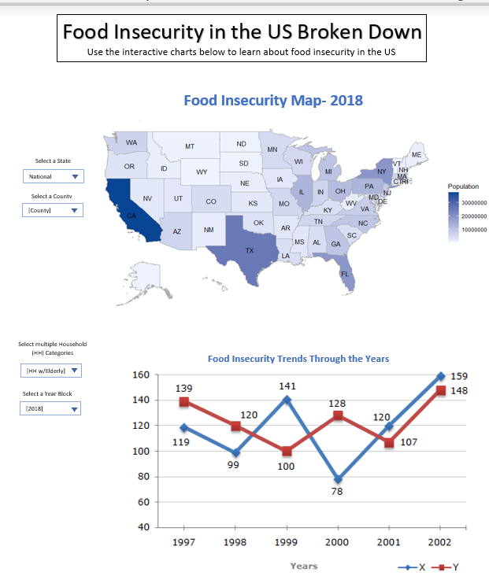

## Project 2

I will attempt to tell a story of food insecurity in the US through data visualizations. The aim is to see the differences in rates between the states, as well as explore various food insecure household types throughout the years. This will be done using reputable data and various programming tools, languages, and libraries.

## [Datasets](https://drive.google.com/drive/folders/1UfVDDV5s6EmfDVd6umg9ecXJoGy_pD_0?usp=sharing)

## Visualization Examples

                              

                              

## Design Sketch

## [GitHub Repo] (https://github.com/m-vasquez/Project2-Food-Insecurity-in-the-US)

